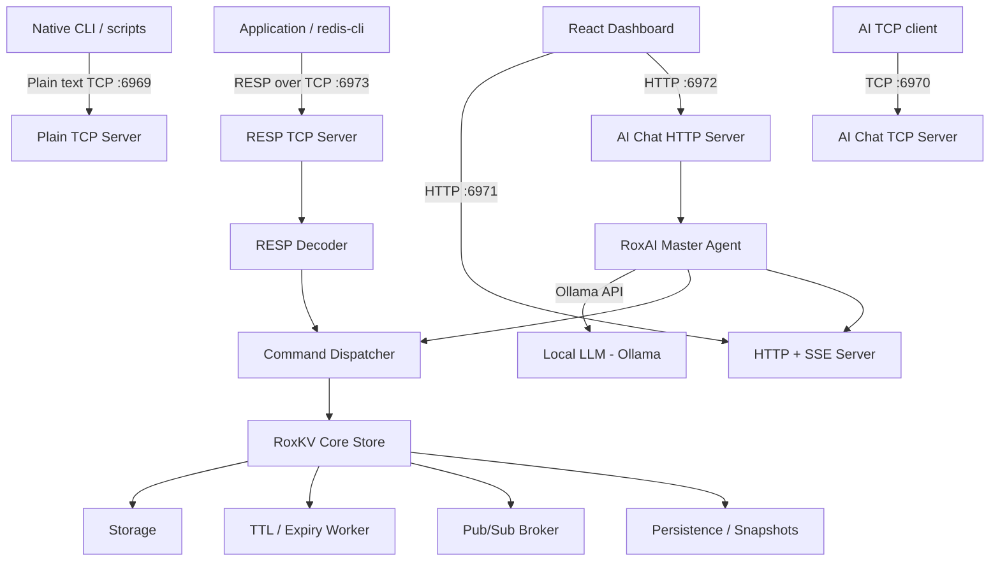

# RoxKV

RoxKV is a custom in-memory key-value database built from scratch in Go. It implements the Redis Serialization Protocol (RESP) and exposes a TCP server that accepts connections from any standard Redis client — including `redis-cli`. Alongside the core database engine, the project ships **RoxAI**: an AI orchestration layer that allows natural language interaction with the database via a local Ollama model.

The project was built as an educational systems programming exercise — a deep dive into TCP servers, concurrent data structures, binary protocol parsing, publish/subscribe messaging, and persistence strategies in Go.

---

## What is Implemented Today

| Layer | Status |
|---|---|
| RESP decoder (7 types) | ✅ Implemented |
| RESP encoder (6 types) | ✅ Implemented |
| TCP RESP server (port 6973) | ✅ Implemented |
| Native TCP CLI server (port 6969) | ✅ Implemented |
| Key-value storage (binary-safe `[]byte`, `sync.RWMutex`-protected) | ✅ Implemented |
| String operations (SET, GET, MGET, STRLEN) | ✅ Implemented |
| Key management (DEL, EXISTS, KEYS, RENAME, RANDOMKEY, DBSIZE, FLUSHDB) | ✅ Implemented |
| Integer arithmetic (INCR, DECR, INCRBY, DECRBY) | ✅ Implemented |
| Key expiration (EXPIRE, TTL, PERSIST) | ✅ Implemented |
| Point-in-time snapshots (SAVE, LASTSAVE) | ✅ Implemented |
| Pub/Sub (SUBSCRIBE, PUBLISH, UNSUBSCRIBE) | ✅ Implemented |
| Pattern Pub/Sub (PSUBSCRIBE, PUNSUBSCRIBE) | ✅ Implemented |
| Subscriber mode enforcement | ✅ Implemented |
| Activity logging (ring-buffer based) | ✅ Implemented |
| Background TTL expiry worker | ✅ Implemented |
| Background snapshot worker | ✅ Implemented |
| HTTP SSE event server (port 6971) | ✅ Implemented |
| AI chat server — HTTP (port 6972) | ✅ Implemented |
| AI chat server — TCP (port 6970) | ✅ Implemented |
| RoxAI master agent (Ollama + tool routing) | ✅ Implemented |
| React web dashboard | ✅ Implemented |
| Documentation site (`/docs`) | ✅ Implemented |
| Docker Compose deployment | ✅ Implemented |
| Redis command compatibility (full) | ❌ Not a goal |
| Hashes, Sets, Sorted Sets, Lists | ❌ Not implemented |
| AUTH / ACL | ❌ Not implemented |
| Clustering / replication | ❌ Not implemented |
| `SET EX` / `SET PX` options | ❌ Not implemented (use `EXPIRE`) |

---

## High-Level Architecture

RoxKV runs four concurrent servers from a single Go binary. They all share a common in-memory store protected by `sync.RWMutex`.



---

## System Layers Explained

### 1. Storage Layer — `internal/store`

The database is a `map[string]Item` protected by `sync.RWMutex`. Each stored `Item` contains:

- `Key` — the string key
- `Val []byte` — the value, stored internally as raw binary-safe bytes (`[]byte`)
- `Meta` — metadata: TTL timestamp, creation time, last-updated time, access count, size in bytes, namespace

Namespaces are extracted automatically from keys containing `:` as a separator (e.g. `user:123` → namespace `user`).

### 2. RESP Compatibility Layer — `internal/resp-parser`

#### Decoder (`decoder.go`)

The decoder reads raw TCP bytes and dispatches on the first byte:

| RESP Prefix | Type | Go Value |
|---|---|---|
| `+` | Simple String | `string` |
| `-` | Simple Error | `string` |
| `:` | Integer | `int64` |
| `$` | Bulk String | `string` |
| `*` | Array | `[]any` |
| `#` | Boolean | `bool` |
| `,` | Double | `float64` |

Client commands arrive as a RESP Array of Bulk Strings. The `DecodeArrayString` function extracts them into a `[]string` token slice.

#### Encoder (`encoder.go`)

RoxKV encodes responses using the following RESP types:

| Function | Sends |
|---|---|
| `EncodeSimpleString` | `+OK\r\n` |
| `EncodeSimpleError` | `-ERR ...\r\n` |
| `EncodeInteger` | `:42\r\n` |
| `EncodeBulkString` | `$5\r\nhello\r\n` |
| `EncodeNullValues` | `$-1\r\n` (nil) |
| `EncodeArray` | `*N\r\n...` (mixed types) |

#### Parser / Dispatcher (`parser.go`)

Each connection reads a RESP frame, decodes it into a `RedisInput{Cmd, Args}` struct, and routes it through a `switch` in `parseCommand`. The dispatcher enforces **Subscriber mode**: once a client has issued `SUBSCRIBE` or `PSUBSCRIBE`, only `(P|S)SUBSCRIBE`, `(P|S)UNSUBSCRIBE`, `PING`, `QUIT`, and `RESET` are permitted.

### 3. TCP Networking Layer — `server/`

| Server | File | Port | Protocol |
|---|---|---|---|
| Native CLI server | `server.go` | `6969` | Plain text |
| AI Chat TCP server | `ChatServer.go` | `6970` | Plain text + Ollama |
| HTTP / SSE server | `WebServer.go` | `6971` | HTTP, Server-Sent Events |
| AI Chat HTTP server | `ChatWebServer.go` | `6972` | HTTP + Ollama |
| RESP-compatible server | `RespServer.go` | `6973` | RESP / TCP |

The RESP server (`RespServer.go`) accepts TCP connections, creates a `utils.NewClient` per connection (with its own mutex and mode tracking), and loops calling `ReadAndHandleConnection` — which decodes the incoming RESP frame and dispatches commands. The server enforces a `MaxConnections = 10` ceiling across both the native and RESP TCP servers. Inactive clients are evicted after 10 minutes of inactivity by a background goroutine.

### 4. Pub/Sub Layer — `internal/pubsub`

RoxKV implements a broker-based Pub/Sub system:

- **Channels** are created lazily on first `SUBSCRIBE` or `PUBLISH`.
- The `SubrChannel` struct holds a `Subscribers` list, a `Publisher` list, message history, and publish count.
- Messages are delivered concurrently to all subscribers via goroutines and `sync.WaitGroup`.
- **Pattern subscriptions** (`PSUBSCRIBE`) use a custom `AsteriskPattern` matcher in `patternmatcher.go`. Patterns must use `.` or `:` as namespace separators and `*` as a wildcard per segment (e.g. `user:*`, `*.events`). Standard Redis glob patterns with `?` or `[...]` are not supported.

### 5. TTL and Expiration — `internal/worker`

Key expiration is handled by a background `ExpiryWorker` goroutine started per-connection. TTL is set by the `EXPIRE` command (in seconds). The `SET` command does **not** support `EX` or `PX` options — expiration must be set separately. Use `TTL` to inspect remaining time and `PERSIST` to remove an expiry.

### 6. Persistence — `internal/persistence`

Persistence uses two mechanisms:

1. **Snapshots**: Point-in-time GOB-encoded snapshots of the entire store. Triggered manually with `SAVE` or automatically by a background `SnapshotWorker`. `LASTSAVE` returns the Unix timestamp of the last snapshot.
2. **Activity Log**: A persistent file-based ring buffer of all operations, accessible via `MONITOR` and the HTTP SSE `activity` stream.

### 7. Binary-Safe Storage

RoxKV stores all values as raw bytes (`[]byte`), providing full binary safety across the system:

- **Raw Byte Storage**: RoxKV stores values as raw bytes (`[]byte`) without UTF-8 string conversion or string allocations.
- **Client Compatibility**: Compatible with `redis-cli`, `redis-py`, `django-redis`, and standard Redis clients.
- **Arbitrary Payload Support**: Supports arbitrary binary payloads (pickle, protobuf, compressed data, images).
- **Migration Reference**: See [BYTES.md](BYTES.md) for migration details.

---

## Supported Commands

The RESP server supports the following commands (verified from `parser.go` and `executor.go`):

**Strings**: `SET`, `GET`, `MGET`, `STRLEN`, `ECHO`  
**Keys**: `DEL`, `EXISTS`, `KEYS`, `RENAME`, `RANDOMKEY`, `DBSIZE`, `FLUSHDB`  
**Integers**: `INCR`, `DECR`, `INCRBY`, `DECRBY`  
**Expiration**: `EXPIRE`, `TTL`, `PERSIST`  
**Pub/Sub**: `SUBSCRIBE`, `UNSUBSCRIBE`, `PUBLISH`, `PSUBSCRIBE`, `PUNSUBSCRIBE`  
**Persistence**: `SAVE`, `LASTSAVE`  
**Connection**: `PING`, `QUIT`, `RESET`, `COMMAND`  
**Server**: `UPTIME`, `MONITOR`, `DBSIZE`  

> **See the full command reference with syntax, arguments, and return types at `/docs/commands` in the web documentation.**

RoxKV is **RESP-compatible for the supported command subset above**. It is not a full Redis replacement and does not claim full Redis compatibility.

---

## RoxAI

RoxAI is the AI orchestration layer built on top of RoxKV. It enables natural language database management without requiring knowledge of commands.

### How It Works

```
User Input
    ↓
RoxAI Master Agent  ←→  Ollama (local LLM)
    ↓
Semantic Tool Router  (selects from registered tools)
    ↓
Tool Executor  (kvagent / monitoragent / pubsubagent / storageagent)
    ↓
RoxKV Core
    ↓
Streamed Response via SSE → React Dashboard
```

The Master Agent (`agents/Master/Masteragent.go`) receives a natural language query and uses an Ollama model to select among registered sub-agent tools. The tool router (`agents/router`) scores each tool based on the query and dispatches execution. Results are streamed back token-by-token via Server-Sent Events.

**Tool categories** (from `agents/Master/constants.go`):
- `kvagent` — key-value read/write/delete/list/save operations  
- `monitoragent` — CPU, RAM, disk, uptime, client stats  
- `pubsubagent` — topic inspection, subscriber/publisher management, history  
- `storageagent` — snapshot listing, storage analytics, TTL inspection  

The model used is configurable via the `OLLAMA_MODEL` environment variable (default: `llama3.1:latest`). All inference runs **locally** — no cloud API keys are required.

---

## Web Dashboard

The React dashboard (`WebDashBoard/roxkv-dashboard`) connects to the SSE server (port 6971) and the AI chat server (port 6972). It provides:

- **Live monitoring**: CPU, RAM, disk, network, goroutine counts
- **Database view**: key count, total key size, TTL metrics, pub/sub topic list
- **Snapshot panel**: snapshot count, latest snapshot, next snapshot time
- **Activity log**: real-time ring-buffer of recent operations
- **AI Chat**: natural language interface with SSE-streamed responses
- **CLI terminal**: direct command execution via the native TCP server

The SSE server (`/api/events/{name}`) exposes four streams: `monitor`, `storage`, `database`, `activity`.

---

## Documentation

The full documentation is available at **`/docs`** in the web dashboard (React app at `WebDashBoard/roxkv-docspage`). This includes:

- Technical overview and RESP flow diagram
- Architecture and server layer breakdown
- Complete command reference with syntax and return types
- Pub/Sub usage and pattern matching rules
- Persistence and TTL behavior
- Protocol and connection lifecycle

---

## Running with Docker (Recommended)

RoxKV and RoxAI are fully containerized for easy deployment without requiring Go or Node.js on your host machine. The Docker setup runs the backend, frontend, and a dedicated Ollama container.

### Requirements
- Git
- Docker & Docker Compose

### Installation

1. Clone the repository:
```bash
git clone https://github.com/rahulkumarparida/roxkv.git
cd roxkv
```

2. Copy the environment template:
```bash
cp .env.example .env
```

3. Start the system:
```bash
docker compose up -d --build
```

### What Happens Next

- **Ollama Model Initialization**: The Ollama container will start and wait to be healthy. If the configured `OLLAMA_MODEL` (default: `llama3.1:latest`) is not present, it will automatically pull it. This may take several minutes depending on your internet connection.
- **Backend Startup**: The backend will wait for Ollama to become healthy before starting.
- **Frontend Startup**: The React dashboard will build its production bundle and become available once the backend is healthy.

### Accessing the Services

- **Dashboard**: http://localhost:5173
- **RoxKV (RESP)**: `localhost:6973`
- **RoxKV (Native CLI)**: `localhost:6969`
- **RoxKV (Events/API)**: `http://localhost:6971`

### Data Persistence

All data is stored in Docker named volumes, meaning it survives container restarts:
- `roxkv-data`: Stores all database snapshots, activity logs, and metrics.
- `ollama-data`: Stores downloaded LLM models so they are not re-downloaded.

To stop the system:
```bash
docker compose down
```

To completely delete the system and its persistent data (WARNING: irreversible):
```bash
docker compose down -v
```

---

## Development & Local Execution

If you prefer to run the system directly on your host machine for development:

### Prerequisites

- Go 1.22+
- Node.js 18+ (for the dashboard)
- [Ollama](https://ollama.com) running locally with `llama3.1` pulled.

### Start RoxKV

```bash
# Start the RoxKV server (all servers start concurrently)
go run ./cmd/roxkv roxkv-tcp
```

### Start the Web Dashboard

```bash
cd WebDashBoard/roxkv-dashboard
npm install
npm run dev
# Dashboard available at http://localhost:5173
```

---

## Connecting with redis-cli

Connect to the RESP-compatible server on port **6973**:

```bash
redis-cli -p 6973

127.0.0.1:6973> PING
PONG

127.0.0.1:6973> SET mykey "hello world"
OK

127.0.0.1:6973> GET mykey
"hello world"
```

---

## Connecting from an Application

Any Redis client library can connect to port **6973** as a standard RESP server:

```go
// Go — using go-redis
rdb := redis.NewClient(&redis.Options{
    Addr: "localhost:6973",
})

val, err := rdb.Set(ctx, "key", "value", 0).Result()
```

---

## Current Limitations

The following Redis functionality is **not implemented** in RoxKV:

| Feature | Notes |
|---|---|
| `SET EX / PX / NX / XX` options | Use `SET` then `EXPIRE` separately |
| Lists, Sets, Hashes, Sorted Sets | String values only |
| `SCAN` / `HSCAN` / `SSCAN` | Not implemented |
| `AUTH` / password protection | Not implemented |
| `SELECT` / multiple databases | Single database only |
| Transactions (`MULTI` / `EXEC`) | Not implemented |
| Lua scripting (`EVAL`) | Not implemented |
| Replication / clustering | Not implemented |
| `PEXPIRE` / millisecond TTL | Seconds only via `EXPIRE` |
| Pattern matching in `KEYS` | Partial — contains-based, not full glob |
| PSUBSCRIBE glob patterns (`?`, `[...]`) | `*` wildcard only, with `.`/`:` namespacing |

---

## License

MIT — see [LICENSE.md](LICENSE.md)
