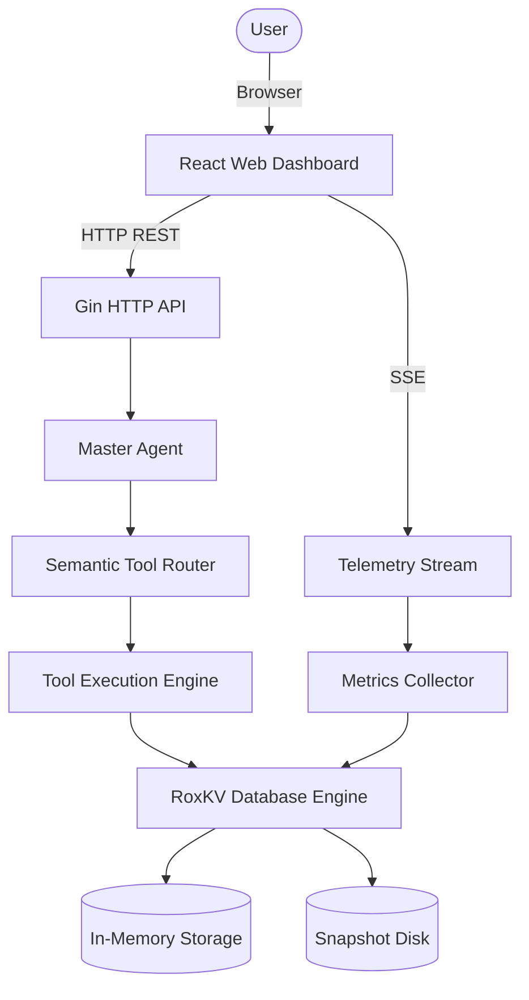
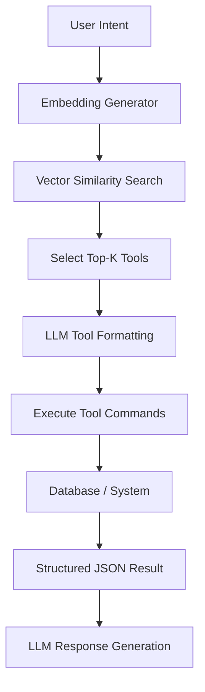
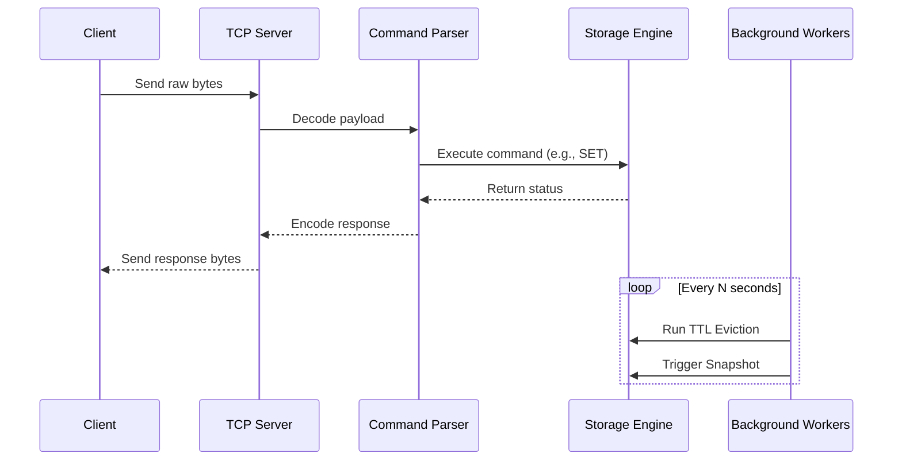
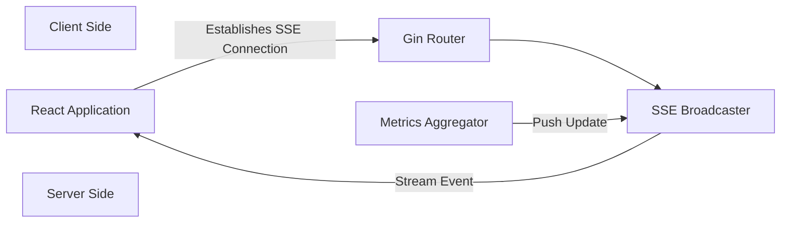
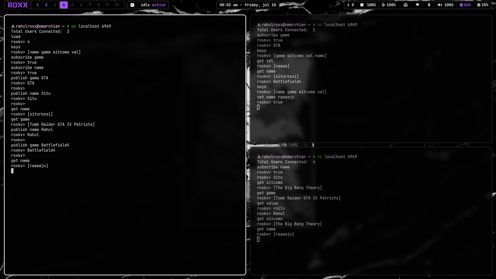
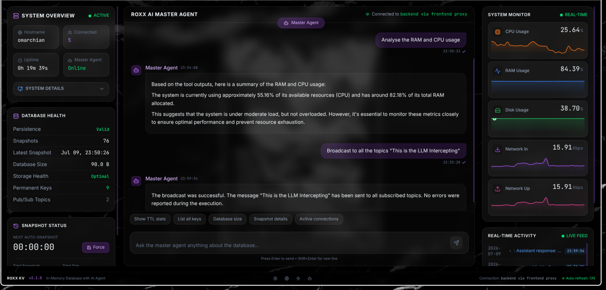
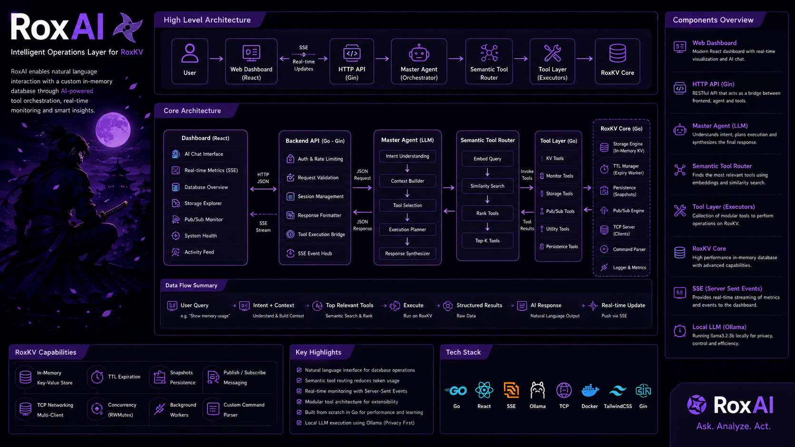

# RoxAI + RoxKV

RoxAI and RoxKV constitute an AI-powered operational interface built on top of a custom, highly concurrent in-memory key-value database. Designed from the ground up in Go, the system integrates a robust storage engine with a sophisticated orchestration layer. It bridges the gap between low-level database operations and high-level natural language intent, providing a seamless control plane for both infrastructure management and data interaction.

The project exists to solve a fundamental friction point in infrastructure management. Traditional databases require operators to memorize specific command syntaxes, manually inspect telemetry data, switch context across disparate dashboards, and possess deep internal knowledge of the system architecture to diagnose issues. This paradigm relies heavily on manual querying and operational cognitive load.

This project serves as a practical exploration of whether natural language can act as a reliable, deterministic operational interface for infrastructure. Instead of replacing the underlying infrastructure, RoxAI sits explicitly on top of RoxKV. It leverages semantic tool routing to translate natural language into deterministic database commands, telemetry queries, and administrative actions, effectively decoupling the operator's intent from the underlying system implementation.

---

## Project Status

RoxAI + RoxKV was developed as part of the AMD Developer Hackathon.

The project demonstrates how a custom in-memory database can be combined with AI-powered tool orchestration to create an intelligent operational interface. The current implementation is a functional prototype showcasing storage, networking, monitoring, AI tool orchestration, and a real-time dashboard.

Future development will focus on Redis protocol compatibility, distributed storage, vector search, authentication, and more advanced AI planning capabilities.

---

# Evolution of the Project

The architecture developed iteratively, evolving from a raw storage engine into a comprehensive, AI-orchestrated infrastructure platform.

### Phase 1: RoxKV
The project originated as RoxKV, a custom in-memory key-value database written entirely from scratch in Go. The goal was to build a robust foundation capable of handling high-throughput concurrent workloads without relying on external storage dependencies.
*   **Storage Engine**: Designed around an in-memory hash map for O(1) average time complexity lookups.
*   **Mutexes and Concurrent Access**: Implemented read-write locks (`sync.RWMutex`) to guarantee thread safety while maximizing read throughput across concurrent routines.
*   **CRUD Operations**: Standardized Create, Read, Update, and Delete operations for base data manipulation.
*   **TCP Networking**: Adopted a custom TCP server to handle low-level packet transmission, ensuring minimal overhead compared to HTTP for raw database commands.
*   **Multiple Clients**: Built connection handlers to manage concurrent client sessions interacting with the shared memory space.
*   **Persistence and Snapshots**: Added disk-backed snapshotting to serialize the memory state, ensuring data durability across system restarts.
*   **TTL (Time-To-Live)**: Implemented background expiration logic to automatically purge stale keys, managing memory lifecycle.
*   **Workers**: Utilized background goroutines to handle periodic tasks like snapshotting and TTL eviction without blocking the main event loop.
*   **Parser and Command Execution**: Developed a custom command parser to interpret raw TCP payloads into executable database functions.

### Phase 2: Networking
To facilitate communication between the storage engine and external actors, a robust networking layer was established.
TCP was selected over HTTP to minimize protocol overhead, reduce latency, and provide a continuous, stateful connection for database clients. Multiple clients communicate with the shared memory pool through independent goroutines spawned per connection, with synchronization handled at the storage layer via mutexes.
The client lifecycle is strictly managed: connections are registered upon successful handshake, monitored for activity, and aggressively cleaned up during inactive periods or abrupt disconnections to prevent file descriptor leaks. Building this custom TCP layer provided critical insights into distributed systems, byte-level data serialization, socket programming, and connection multiplexing.

### Phase 3: Pub/Sub
To evolve RoxKV from a static storage engine into a dynamic messaging system, a Publish/Subscribe (Pub/Sub) model was introduced.
This paradigm was added to support event-driven architectures, allowing clients to react to data changes asynchronously.
*   **Topics**: Logical channels where messages are broadcasted.
*   **Publishers**: Clients that push payloads to specific topics.
*   **Subscribers**: Clients listening to topics for real-time updates.
*   **Broadcasting and Concurrent Messaging**: Handled via Go channels, enabling non-blocking, concurrent message delivery to all active subscribers.
*   **Real-Time Communication**: Enables immediate notification propagation, bypassing the need for aggressive client-side polling.

This capability elevated RoxKV beyond a simple key-value store, positioning it as a lightweight message broker capable of real-time event streaming.

### Phase 4: Monitoring Layer
As the system complexity grew, visibility into internal state became critical, necessitating a dedicated monitoring subsystem.
This layer continuously tracks:
*   **CPU, RAM, and Disk Usage**: Host-level resource utilization.
*   **Go Runtime Metrics**: Goroutine counts, garbage collection statistics, and heap allocations.
*   **Client Statistics**: Active connections and connection churn.
*   **Server Uptime and Storage Statistics**: Total keys, memory fragmentation, and database capacity.
*   **Snapshots and TTL Statistics**: Frequency of persistence events and expiration rates.
*   **Command Count**: Throughput metrics (operations per second).

Crucially, these metrics were not designed solely for human consumption; they form the foundational data structures that act as executable tools for the AI layer in subsequent phases.

### Phase 5: Storage Intelligence
Building upon the raw metrics, a storage analysis layer was developed to provide semantic meaning to the telemetry data.
This module performs deep inspections of the data state:
*   **Storage and Snapshot Health**: Validating data integrity and backup recency.
*   **TTL Analysis**: Profiling keys approaching expiration.
*   **Metadata**: Extracting structural information without reading full values.
*   **Key Profiling**: Identifying the oldest, newest, and largest keys to diagnose memory bloat.
*   **Namespaces and Persistence Analysis**: Grouping logical datasets and evaluating write-ahead patterns.
*   **Health Reports**: Aggregating subsystem states into comprehensive diagnostic summaries.

This intelligence transforms raw bytes and counts into actionable operational insights, allowing for automated capacity planning and anomaly detection.

### Phase 6: AI Layer
The introduction of RoxAI shifted the interaction paradigm. RoxAI is strictly an orchestration layer, not a conversational chatbot. It interprets intent and maps it to deterministic system actions.

**Architecture Flow:**
`User → Master Agent → Semantic Tool Router → Relevant Tools → Execution → Structured Data → Final Response`

To ensure scalability and maintain low latency on hardware with limited resources (e.g., local 10GB RAM environments), Semantic Routing was introduced. Instead of loading the context window with 40-50 possible system tools, the router performs a similarity search against the user's intent to select only the top-K relevant tools. This significantly reduces the prompt context size, lowers inference times, and makes smaller local LLMs viable for complex orchestration.

The Master Agent is heavily constrained to prevent hallucination: it never fabricates data. It relies entirely on the structured JSON output of the executed tools. Every capability of the database—from querying a key to analyzing runtime memory—is exposed as an isolated tool.

Examples of natural language operations:
*   "What is consuming my RAM?"
*   "What is the health of the database?"
*   "Show active topics."
*   "List all expired keys."

The system is capable of chain-of-thought execution, combining multiple tools (e.g., retrieving the largest keys, then querying the TTL of those specific keys) to formulate a single, cohesive response.

### Phase 7: Web Dashboard
To provide a visual control plane alongside the AI interface, a comprehensive dashboard was engineered.
*   **React and Gin Backend**: The frontend utilizes React for component-driven UI, communicating with a Go (Gin) HTTP backend.
*   **Server-Sent Events (SSE)**: Selected over WebSockets for one-way, low-latency telemetry streaming. SSE is ideal for real-time monitoring where the server continuously pushes metrics to the client without requiring bidirectional message frames.
*   **Features**: Includes Real-time monitoring, an integrated AI Chat interface, Database Health visualization, Snapshot management, Live Metrics, an Activity Feed, and a general System Overview.
*   **Data Flow**:

    `Dashboard → HTTP API → Master Agent → Tools → Response` (AI Request Pipeline)
    
    While concurrently running:
    
    `SSE Streams → Metrics → Live Dashboard` (Telemetry Pipeline)

The AI inference requests and the real-time telemetry streams operate as strictly independent pipelines to ensure that intensive LLM computations do not block or degrade the monitoring UI.

---

# Architecture

### High-Level Architecture


### AI Tool Architecture


### Data Flow


### Dashboard & SSE Architecture


---

# Project Structure

```text
├── cmd/             # Application entry points (main routines for server and agents)
├── internal/        # Private application and library code
├── agents/          # AI logic, master agent orchestration, and tool definitions
├── metrics/         # Subsystem for collecting CPU, RAM, and runtime telemetry
├── storage/         # Core in-memory hash map, mutex management, and CRUD operations
├── pubsub/          # Publish/Subscribe message broker logic and topic management
├── worker/          # Background processes for TTL eviction and snapshot persistence
├── parser/          # TCP payload interpretation and protocol definition
├── telemetry/       # Event tracking, logging, and operational data pipelines
├── dashboard/       # Backend logic specific to servicing the web UI
├── frontend/        # React application source code and assets
└── ...
```

---

# Major Features

| Feature | Purpose | Implementation | Benefits |
| :--- | :--- | :--- | :--- |
| **In-Memory Storage** | High-speed data access | Go `map` guarded by `sync.RWMutex` | Microsecond latency for reads/writes; minimal lock contention. |
| **Semantic Tool Routing** | Scale AI capabilities without context limits | Vector embeddings and cosine similarity search | Enables using small local LLMs; drastically reduces token overhead. |
| **TCP Protocol** | Low-latency binary communication | Custom Go `net.Listener` and socket handlers | Lower overhead than HTTP; stateful connections for clients. |
| **Real-time Pub/Sub** | Asynchronous event architecture | Concurrent Go channels mapping topics to subscribers | Transforms the database into a reactive message broker. |
| **Background Workers** | System maintenance without blocking | Detached goroutines with ticker intervals | Automatic memory management (TTL) and data durability (Snapshots). |
| **SSE Telemetry** | Live monitoring interface | HTTP Server-Sent Events pushed from Gin | Low-latency dashboard updates without WebSocket complexity. |
| **Storage Intelligence** | Deep data profiling | Aggregation algorithms analyzing metadata | Operational insights into memory bloat and usage patterns. |

---

# Engineering Decisions

*   **Go**: Selected for its exceptional concurrency primitives (goroutines, channels), compiled performance, and robust standard library (specifically `net` for TCP).
*   **TCP over HTTP**: Chosen for the core database protocol to minimize header overhead and establish persistent, stateful connections for clients.
*   **Server-Sent Events (SSE)**: Chosen for the dashboard telemetry as it perfectly fits the one-way (server-to-client) data flow requirement, avoiding the heavy lifecycle management of WebSockets.
*   **React & Gin**: React provides a reactive, component-based UI, while Gin offers a high-performance, lightweight HTTP routing layer to interface with the Go backend.
*   **Ollama & Local LLMs**: Ensures data privacy and offline capability. Reduces dependency on external cloud providers for orchestration.
*   **Semantic Routing**: Mitigates the small context window limitations of local models. Instead of passing schemas for 50 tools, only the 3-5 most relevant are injected into the prompt.
*   **Strict Tool Calling**: Enforces deterministic outputs. The LLM acts purely as a router and summarizer; it does not execute logic, preventing hallucination.
*   **Mutexes (`sync.RWMutex`)**: Granular read-write locks were favored over global locks to ensure high read concurrency while maintaining thread safety during writes.
*   **Workers & Snapshots**: Dedicated goroutines isolate heavy I/O tasks (writing state to disk, scanning for TTL) from the critical path of the TCP event loop.

---

# Challenges Faced

*   **Running Local LLMs on 10GB RAM**: Hardware constraints made it impossible to load large models or use vast context windows. This forced the engineering of highly optimized prompts and the semantic routing layer.
*   **Model Limitations & Tool Routing**: Smaller local models struggle with complex function calling syntax and massive tool definitions, leading to erratic output.
*   **Architecture Redesign**: Transitioning from a multi-agent debate system (which was too slow and token-heavy) to a streamlined semantic router drastically improved latency.
*   **React StrictMode with SSE**: Double-mounting in React StrictMode caused duplicate SSE connections and ghost streams, requiring careful implementation of `useEffect` cleanup functions.
*   **Long Inference Time**: Local model inference blocked synchronous operations. The solution involved decoupling the AI pipeline from the monitoring pipeline to ensure the UI remained responsive.
*   **Memory Constraints**: In-memory databases inherently face RAM limits. Implementing aggressive TTL algorithms and optimizing Go struct memory alignment were necessary to maximize capacity.

---

# Future Roadmap

*   **Redis Protocol Compatibility**: Implementing the RESP protocol to allow existing Redis clients (e.g., `redis-cli`) to interact seamlessly with RoxKV.
*   **Vector Search & Embeddings**: Natively supporting vector data types and similarity search within the database engine for faster AI retrievals.
*   **Authentication & RBAC**: Introducing connection handshakes with credential verification and role-based access control.
*   **Distributed Cluster & Replication**: Moving from a single-node architecture to a Raft-based consensus cluster with master-replica replication.
*   **Scheduling & Workflow Automation**: Allowing the AI layer to schedule cron-like tasks and orchestrate multi-step automated workflows natively.
*   **Memory Optimization**: Implementing custom memory allocators to bypass Go GC pauses for massive datasets.
*   **Plugin System**: Permitting dynamically loaded shared libraries (.so) to extend database functionality without recompilation.

---

# Tech Stack

| Domain | Technology |
| :--- | :--- |
| **Core Systems Language** | Go (Golang) |
| **Networking** | Raw TCP, HTTP/1.1 |
| **Concurrency Model** | Goroutines, Channels, `sync.RWMutex` |
| **AI Orchestration** | Local LLMs (Ollama), Custom Semantic Router |
| **Backend Framework** | Gin (HTTP API & SSE) |
| **Frontend Framework** | React.js, Vite |
| **Data Streaming** | Server-Sent Events (SSE) |
| **Deployment** | Docker, Docker Compose |

---

# How to Run

### Docker Compose (Recommended)
```bash
git clone https://github.com/rahulroxx/roxkv.git
cd roxkv
docker-compose up --build
```

### Local Build
**Backend:**
```bash
cd cmd/server
go build -o roxkv-server
./roxkv-server
```

**Frontend:**
```bash
cd frontend
npm install
npm run dev
```

---

# Screenshots








---

# Example Commands

### Database Operations (TCP)
```bash
SET mykey "Hello World"
GET mykey
DEL mykey
EXPIRE mykey 60
```

### Pub/Sub Operations
```bash
SUBSCRIBE "system_events"
PUBLISH "system_events" "Backup completed successfully"
```

### AI Orchestration (HTTP/Dashboard)
```json
POST /api/chat
{
  "prompt": "Show me the largest keys currently stored."
}
```

### Monitoring
```bash
INFO SERVER
INFO MEMORY
```

---

# Example AI Queries

1. "What is the overall health of the database?"
2. "List all keys that are expiring in the next 5 minutes."
3. "Why is my RAM usage so high right now?"
4. "Show me the 10 largest keys in memory."
5. "Create a snapshot of the current database state."
6. "How many active TCP clients are connected?"
7. "What is the current operation throughput (commands per second)?"
8. "Which topic has the most active subscribers?"
9. "Purge all expired keys immediately."
10. "Give me a breakdown of memory fragmentation."
11. "Who is the oldest client connected?"
12. "What are the latest system errors logged?"
13. "Calculate the average size of stored values."
14. "Disable background snapshots temporarily."
15. "Publish a maintenance warning to the 'alerts' topic."
16. "How many goroutines are currently active in the runtime?"
17. "Compare current disk usage against yesterday's metrics."
18. "Are there any deadlocked connections?"
19. "Set the TTL of 'cache_token' to 3600 seconds."
20. "Generate a comprehensive health report for the storage engine."

---

# Lessons Learned

Building RoxAI and RoxKV provided profound insights into several computer science domains:
*   **Systems Programming**: Designing a database from scratch enforces a rigorous understanding of memory allocation, pointer arithmetic, and cache locality.
*   **AI Orchestration**: LLMs are powerful, but non-deterministic. Building an orchestration layer proved that strict constraints, semantic routing, and structured tool outputs are mandatory for reliable infrastructure automation.
*   **Networking**: Implementing raw TCP servers highlighted the exact overhead added by HTTP and the complexities of managing persistent socket lifecycles, EOF handling, and broken pipes.
*   **Tool Execution**: Bridging the gap between natural language strings and executable Go functions required building highly resilient parsers and error-handling boundaries.
*   **Concurrency & Go**: The project served as an extensive exercise in Go's concurrency model. Managing race conditions, preventing deadlocks with `RWMutex`, and avoiding goroutine leaks became primary engineering focuses.

---

# License

This project is licensed under the MIT License - see the [LICENSE](LICENSE) file for details.

---

# Author

**Rahul Kumar Parida**
*   GitHub: [rahulroxx](https://github.com/rahulroxx)
*   LinkedIn: [Rahul Kumar Parida](https://linkedin.com/in/placeholder)
